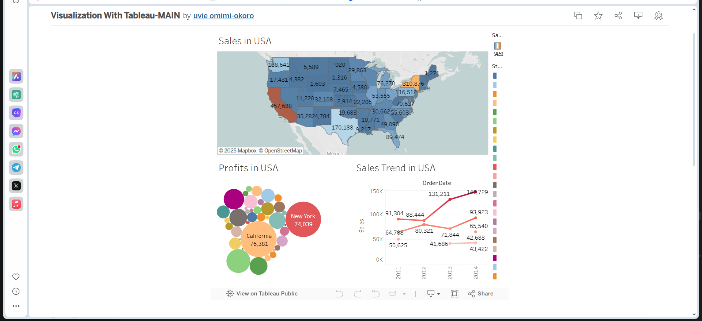

# 🍋 Little Lemon Database Capstone Project-

## 📌 Project Overview  
This capstone project demonstrates key **data engineering** skills by designing and implementing a **database solution** for a restaurant business, **Little Lemon**.  
The project covers:  
✅ **Star Schema Design** using MySQL Workbench  
✅ Setting up a **database environment**  
✅ Creating optimized **SQL queries**  
✅ Managing **sales reports & table bookings**  
✅ **Data visualization** using Tableau  
✅ Building a **database client** in Python  

By completing this project, I combined multiple **data engineering concepts** into a single **real-world** scenario.  

---

## 📊 Tableau Interactive Dashboard  
Below is a **screenshot** of the Tableau Dashboard, which includes **visualizations** for **sales trends, profits, and geographical insights**.  

  

👉 **[View Interactive Dashboard on Tableau Public](https://public.tableau.com/app/profile/uvie.omimi.okoro/viz/VisualizationWithTableau-MAIN/Dashboard1?publish=yes)**  

📂 **Download the Tableau Workbook (`.twbx` file) here**:  
[`ALL_TABLEAU_WORKSHEET_AND_INTERACTIVE_DASHBOARD.twbx`](ALL%20TABLEAU%20PNG%20AND%20FILES/ALL_TABLEAU_WORKSHEET_AND_INTERACTIVE_DASHBOARD.twbx)  

---

## 📌 Star Schema Design  
A **Star Schema** was designed using **MySQL Workbench** to optimize database performance. This schema includes:  
- **Fact Table**: Stores sales transactions, order details, and revenue.  
- **Dimension Tables**: Contains customer info, products, dates, and locations.  

Using **Star Schema** ensures **faster query performance**, **simplified data retrieval**, and **efficient aggregation** for reporting.  

---

## 🚀 Skills & Technologies Used  


---

## 📂 Project Breakdown  

### **🔹 Module 1: Database & Star Schema Design**  
- Created **ER diagrams** and **Star Schema** using MySQL Workbench  
- Set up database tables optimized for **query performance**  
- Initialized a **Git repository** and managed version control  

### **🔹 Module 2: Sales Reports & Booking System**  
- Generated **virtual tables** using SQL JOINs  
- Created optimized queries for **sales reporting**  
- Built an **SQL-based table booking system**  

### **🔹 Module 3: Data Visualization & Database Client**  
- Developed a **Tableau dashboard** for **sales insights**  
- Created a **Python-based database client** with query functions  

### **🔹 Module 4: Review & Optimization**  
- Peer-reviewed database implementation  
- Optimized queries and finalized **database structure**  

---

## 🔧 Installation & Setup  

### **1️⃣ Clone the Repository**
```bash
git clone https://github.com/temptrix/db-capstone-project.git
cd db-capstone-project
